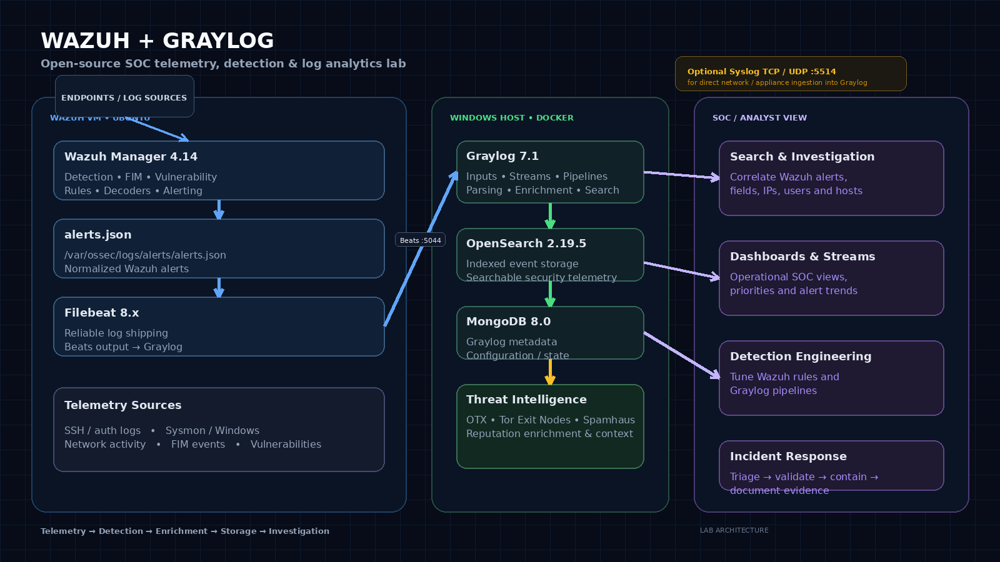
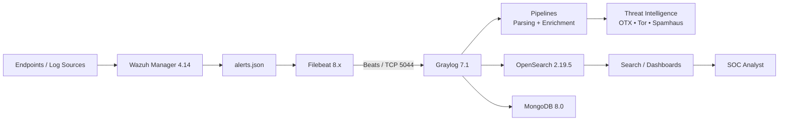

#  Wazuh + Graylog SIEM Lab

<p align="center">
  
</p>

<p align="center">
  <b>Open-source SIEM & SOC monitoring lab combining Wazuh detection with Graylog centralized log management, enrichment and investigation.</b>
</p>

<p align="center">
  <a href="https://wazuh.com/"></a>
  <a href="https://graylog.org/"></a>
  <a href="https://www.docker.com/"></a>
  
  
</p>

---

##  What This Lab Demonstrates

This project builds a practical **security monitoring and SIEM lab** around two complementary platforms:

- **Wazuh** acts as the endpoint security and detection layer, generating structured security alerts from host telemetry.
- **Graylog** acts as the centralized log management, search, pipeline and investigation layer.
- **Filebeat** reliably ships Wazuh alert data from the Wazuh manager to Graylog over the Beats protocol.
- **OpenSearch** stores indexed events for search and analysis.
- **MongoDB** stores Graylog metadata and configuration state.
- **Threat intelligence enrichment** adds external context to indicators such as IP addresses.
- **Custom Wazuh rules** demonstrate detection engineering for activity such as SSH brute-force attempts and Nmap scanning.

The result is a compact, reproducible SOC environment suitable for **detection engineering, log analysis, threat hunting, SIEM administration and incident-response practice**.

> **Lab scope:** This repository is intended as a security lab / portfolio implementation. Production deployments should add HA, hardened secrets management, TLS, access controls, backups, monitoring and capacity planning appropriate to the environment.

---

##  Architecture

### Telemetry Flow



The primary integration path is:

**Wazuh Manager → `alerts.json` → Filebeat → Graylog Beats input (`5044`) → Pipelines / Enrichment → OpenSearch → Investigation**

Graylog can also expose a **Syslog TCP/UDP input such as `5514`** when direct network-device, appliance or other syslog ingestion is required. That is separate from the Wazuh-to-Graylog Beats transport.

---

##  Key Capabilities

| Layer | Capability |
|---|---|
| **Endpoint Security** | FIM, vulnerability detection, log collection, security monitoring |
| **Detection** | Custom Wazuh rules and decoders for attack patterns |
| **Log Transport** | Filebeat → Graylog Beats input |
| **Log Management** | Streams, fields, pipelines, search and dashboards |
| **Enrichment** | Threat reputation, Tor exit-node checks, Spamhaus intelligence |
| **Storage** | OpenSearch-backed indexed event data |
| **Investigation** | Search, correlation, indicator pivoting and evidence review |
| **Lab Operations** | Docker Compose deployment and reproducible configuration |

---

##  Technology Stack

| Component | Version / Role |
|---|---|
| **Wazuh** | `4.14` — endpoint detection & response |
| **Graylog** | `7.1` — log management & analysis |
| **Filebeat** | `8.x` — telemetry shipping |
| **OpenSearch** | `2.19.5` — indexed event storage |
| **MongoDB** | `8.0` — Graylog metadata |
| **Docker** | `24+` — container runtime |
| **Docker Compose** | `2+` — service orchestration |
| **Ubuntu** | `22.04 / 24.04 LTS` — Wazuh VM |
| **Windows** | `10/11 Pro` — Graylog Docker host |

---

##  Deployment

### 1. Start Graylog

From the repository directory:

```bash
cd wazuh-graylog-siem-lab
docker compose up -d
```

Verify the containers:

```bash
docker compose ps
```

Open Graylog:

```text
http://<WINDOWS_IP>:9000
```

### 2. Create Graylog Inputs

In Graylog, go to:

**System → Inputs**

Create:

**Beats / Logstash**
```text
Port: 5044
```

Optional for direct syslog ingestion:

**Syslog TCP / UDP**
```text
Port: 5514
```

### 3. Configure Wazuh Rules and Decoders

Copy the lab rules:

```bash
sudo cp wazuh/local_rules.xml /var/ossec/etc/rules/
sudo cp wazuh/local_decoder.xml /var/ossec/etc/decoders/
```

Validate the Wazuh configuration before restarting:

```bash
sudo /var/ossec/bin/wazuh-analysisd -t
```

Restart the manager:

```bash
sudo systemctl restart wazuh-manager
```

### 4. Configure Filebeat

Install / configure Filebeat according to your Wazuh deployment, then place the project configuration in:

```text
/etc/filebeat/filebeat.yml
```

Restart:

```bash
sudo systemctl restart filebeat
```

Check the service:

```bash
sudo systemctl status filebeat
```

### 5. Test the Integration

Run:

```bash
bash scripts/test-integration.sh
```

Then search Graylog for incoming Wazuh events.

---

##  Detection Engineering

### SSH Brute-Force Use Case

The lab includes custom rules for detecting repeated SSH authentication failures.

| Rule ID | Level | Detection |
|---|---:|---|
| `100010` | 5 | SSH invalid-user attempt |
| `100011` | 5 | SSH failed-password attempt |
| `100012` | 10 | SSH brute force — 5+ failures within 60 seconds |

Example investigation flow:

```text
Authentication failure
        ↓
Repeated source IP
        ↓
Threshold exceeded
        ↓
Wazuh correlation rule
        ↓
High-severity alert
        ↓
Graylog search / enrichment
        ↓
SOC investigation
```

### Nmap Scanning Use Case

| Rule ID | Level | Detection |
|---|---:|---|
| `100013` | 8 | Nmap scan detected |
| `100014` | 10 | High-frequency Nmap scan |

These rules provide a starting point for expanding the lab into **MITRE ATT&CK-aligned detection engineering**.

---

##  Threat Intelligence Enrichment

Graylog pipelines can enrich Wazuh events using external intelligence sources:

| Source | Purpose |
|---|---|
| **AlienVault OTX** | Community-driven indicator intelligence |
| **Tor Exit Nodes** | Detect known Tor exit-node IPs |
| **Spamhaus DROP / EDROP** | Flag known malicious network ranges |

### AlienVault OTX

Create an OTX account and obtain an API key from your profile.

Then configure the relevant Graylog lookup / HTTP JSONPath data adapter and reference the adapter from your pipeline logic.

> Store API keys outside version control. Do not commit secrets to `docker-compose.yml`, pipeline files or the repository.

---

##  Example Enriched Event

A normalized event can expose fields such as:

```json
{
  "timestamp": "2026-09-08T12:00:00Z",
  "rule.id": "100012",
  "rule.level": 10,
  "rule.description": "SSH brute force attack detected",
  "agent.name": "wazuh",
  "data.srcip": "192.168.1.100",
  "threat_reputation": 100,
  "threat_categories": [
    "SSH Brute-Force Honeypot Live"
  ],
  "threat_known": true,
  "tor_exit_node": false,
  "spamhaus_flag": false
}
```

The exact fields depend on the Wazuh alert, Graylog pipeline rules and enrichment adapters configured in the deployment.

---

##  Verification Checklist

### Wazuh

```bash
sudo systemctl status wazuh-manager
sudo tail -f /var/ossec/logs/alerts/alerts.json
```

### Filebeat

```bash
sudo systemctl status filebeat
sudo journalctl -u filebeat -f
```

### Graylog

Check:

```text
System → Inputs
```

Confirm that the Beats input is running on:

```text
5044/tcp
```

Then search for Wazuh events using fields appropriate to your index/message schema, for example:

```text
source:wazuh
```

or search directly for:

```text
rule.id:100012
```

---

##  Troubleshooting

### Wazuh alerts exist but Graylog receives nothing

Check the complete chain:

```text
Wazuh Manager
   ↓
alerts.json
   ↓
Filebeat
   ↓
Network / firewall
   ↓
Graylog Beats input :5044
   ↓
Graylog processing
```

Useful commands:

```bash
sudo tail -f /var/ossec/logs/alerts/alerts.json
sudo journalctl -u filebeat -f
docker compose logs -f graylog
```

### Port 5044 is reachable but events are missing

Verify:

- Graylog Beats input is running.
- Filebeat output points to the correct Windows host/IP.
- Docker publishes `5044`.
- Windows Firewall allows the port.
- The Filebeat configuration contains the expected Wazuh alert input.
- Graylog pipelines/streams are not dropping or incorrectly routing messages.

### Syslog 5514 is not the Wazuh transport

`5514` is typically used in this lab for **direct syslog ingestion**. Wazuh alerts are transported through the **Filebeat → Beats input on `5044`** path.

---

##  Security Use Cases to Extend

This lab can be expanded into a much stronger SOC portfolio project by adding:

- Windows Defender and Sysmon telemetry
- Active Directory authentication monitoring
- Privilege escalation detections
- PowerShell and LOLBin detections
- RDP brute-force and suspicious logon detection
- DNS anomaly detection
- Web server attack detection
- IOC matching against external feeds
- MITRE ATT&CK technique tagging
- Graylog alerting and event definitions
- Case management / incident workflow
- SOAR integration for automated response
- Sigma-based detection engineering
- Detection validation with Atomic Red Team or controlled lab simulations

---

##  Suggested Portfolio Metrics

Once the lab is operational, document measurable results such as:

```text
Telemetry sources integrated:       X
Wazuh custom rules:                 X
Graylog pipelines:                  X
Threat-intelligence sources:        X
Detections validated:               X
Mean alert investigation time:      X
False positives reduced:            X%
```

This turns the repository from a configuration dump into a demonstrable **SOC engineering project**.

---

##  Security Notes

This repository is designed for a controlled lab environment.

Before adapting it to production:

- Enable TLS for relevant transport paths.
- Use strong, unique credentials.
- Move secrets to environment variables or a secrets manager.
- Restrict Graylog/OpenSearch exposure with firewall rules.
- Avoid exposing administration interfaces directly to the Internet.
- Configure retention and storage policies.
- Back up Graylog configuration and important indexes.
- Monitor resource utilization and ingestion rates.
- Apply least-privilege access controls.

---

## 📚 Documentation

- [`docs/architecture.md`](docs/architecture.md) — architecture and data flow
- [`docs/troubleshooting.md`](docs/troubleshooting.md) — operational troubleshooting
- [`filebeat/filebeat.yml`](filebeat/filebeat.yml) — Wazuh → Graylog shipping configuration
- [`wazuh/local_rules.xml`](wazuh/local_rules.xml) — custom detection rules
- [`graylog/pipelines/`](graylog/pipelines/) — enrichment and processing logic

---

##  What You Learn From This Lab

This project provides hands-on exposure to:

**SIEM administration**  
Deploying, configuring and operating a centralized security log platform.

**Detection engineering**  
Writing and tuning custom Wazuh rules and decoders.

**Log engineering**  
Shipping, parsing, normalizing and enriching telemetry.

**Threat intelligence**  
Adding reputation and contextual intelligence to indicators.

**Threat hunting**  
Searching large volumes of security telemetry to investigate hypotheses.

**Incident response**  
Moving from alert → validation → investigation → documented evidence.

**SOC architecture**  
Understanding how endpoint security, telemetry transport, SIEM processing, storage and analyst workflows fit together.

---

## 📜 License

This project is licensed under the [MIT License](LICENSE).

---

## ⭐ Acknowledgments

This lab builds on the Wazuh and Graylog ecosystems and the practical integration approach documented in the project's technical write-up.

Technical reference:

[Wazuh + Graylog Technical Write-up](https://www.linkedin.com/posts/aftab-ahmed-823428365_technicalwrite-up-activity-7503157365538664448-VcTk)

---

<p align="center">
  <b>Built for hands-on SOC engineering, detection development and security monitoring.</b>
</p>
